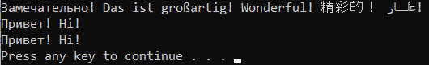

# ConsoleAppUnicodeUTF8
Пример консольной программы с UTF-8 на C# (Net 6.0)



```
using System.Runtime.InteropServices;
using System.Text;

if (RuntimeInformation.IsOSPlatform(OSPlatform.Windows))
{
    Console.InputEncoding = Encoding.Unicode;
    Console.OutputEncoding = Encoding.Unicode;
}
Console.WriteLine("Замечательно! Das ist großartig! Wonderful! 精彩的！ رائع! ");
var line = Console.ReadLine();
Console.WriteLine(line);
Console.Write("Press any key to continue . . . ");
Console.ReadKey(true);

```
запуск из Windows:
ConsoleAppUnicodeUTF8.exe
dotnet ConsoleAppUnicodeUTF8.dll

запуск из WSL:
wsl dotnet ConsoleAppUnicodeUTF8.dll
(!) Но сперва надо установить и настроить это: https://dotnet.microsoft.com/en-us/download/dotnet/thank-you/sdk-6.0.302-linux-x64-binaries
